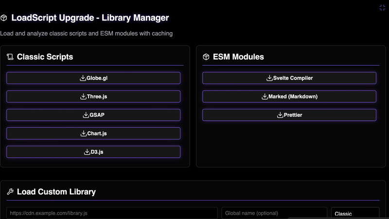

  
  
  <h1 align="center">LOAD SCRIPT</h1>
  <h3 align="center"> Universal JS Script & ESM Loader </h3>

  <!-- TOP PURPLE LINKS -->
  
  
  
   
  <!-- BOTTOM GOLD TAXONOMY -->
  
  
  
  

  

    <i> A robust and comprehensive utility that dynamically fetches, caches, and executes external JavaScript libraries natively inside Obsidian. </i>
  

  

Welcome to **Load Script**, a powerful developer utility and caching engine designed to turbocharge your Obsidian components. By managing local cache deduplication and natively executing ESM and Classic scripts, this tool provides offline-first reliability for heavily customized Datacore setups.

---

## ✨ Features

### 🌐 Universal Script Loading
*   📦 **Classic & ESM Support**: Flawlessly loads both traditional global-variable scripts and modern ECMAScript Modules (`.js` and `.mjs`) directly into your vault runtime.
*   🔗 **URL & Local Paths**: Supports real-time fetching from external CDNs (like unpkg or jsDelivr) as well as hardcoded paths inside your local Obsidian directories.

### 🧠 Intelligent Caching
*   💾 **Vault File Caching**: First-time web URL loads are automatically cached locally inside your `.datacore/script_cache` folder. All subsequent executions load instantly from disk, guaranteeing **offline functionality**.
*   ⚡ **Global Deduplication**: Checks running memory for identical library initializations to prevent redundant downloads and handles race-condition tracking.

### 🔬 Interactive UI & Explorer
*   🧪 **Live Demo UI**: The component itself includes an immersive testing interface acting as a live sandbox.
*   📊 **Real-Time Analysis**: When a library is loaded, the engine immediately parses the prototype tree, displaying its exports, available constants, functions, and deeply nested objects.
*   🔍 **Object Drilldown Explorer**: Includes a navigable recursive inspector to drill down into memory variables directly from the UI.

---

## 📦 Directory Index & Components

The package exposes the following compiled files:

| File | Description |
| :--- | :--- |
| **[`LOAD SCRIPT.md`](LOAD%20SCRIPT.md)** | The main entry point leaf designed to be loaded inside Obsidian panes. |
| **[`src/index.jsx`](src/index.jsx)** | Main bootstrap application loader and polling invalidation daemon. |
| **[`src/App.jsx`](src/App.jsx)** | The interactive Sandbox UI Coordinator and Object Explorer interface. |
| **[`src/LoadScriptUpgrade.js`](src/LoadScriptUpgrade.js)** | Core fetching, deduplication, and local caching script library logic. |
| **[`data/mcp_commands.json`](data/mcp_commands.json)** | Local polling payload for HMR invalidation. |
| **[`METADATA.md`](METADATA.md)** | Packaging manifest outlining indexing, target, and security configurations. |
| **[`CONTRIBUTION.md`](CONTRIBUTION.md)** | Contributor architecture standards and local compilation guidelines. |
| **[`LICENSE.md`](LICENSE.md)** | MIT open-source license. |
